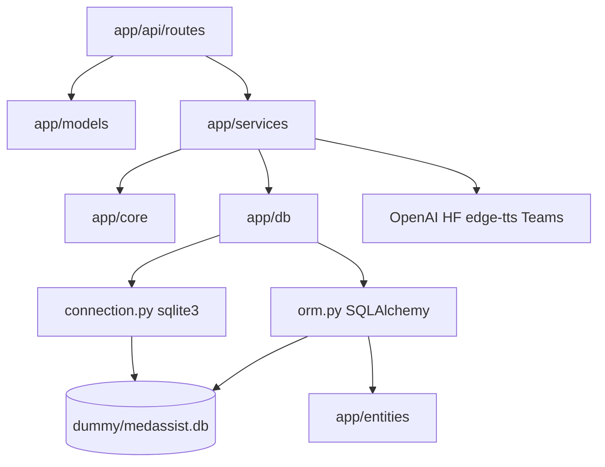

# Kiến trúc backend — MedAssist API

Cập nhật theo code tại `src/api/` (FastAPI).

## Mục tiêu và stack

- **Vai trò:** API cho chat MedAssist (streaming), danh mục y tế, session/patient draft, đặt lịch, audio STT/TTS, portal admin tối thiểu.
- **Stack:** Python 3.11+, FastAPI, Pydantic, Uvicorn; SQLite demo; client OpenAI-compatible (chat, embedding, STT tùy cấu hình); Hugging Face cho STT cục bộ; edge-tts cho TTS.

## Phân lớp (layering)



- **`main.py`:** factory FastAPI, CORS, metadata OpenAPI, health/db ping, `include_router` với prefix `/api`.
- **`api/routes`:** nhận HTTP, validate body/query, gọi service.
- **`services/ai`:** orchestration chat SSE, pipeline bước MedAssist, embeddings, audio.
- **`services/crud`:** truy vấn SQLite (catalog, slot, appointment, admin appointments).
- **`services/general`:** JWT demo, session draft, validator, Teams webhook.
- **`core`:** settings, TTL cache session/chat, enum/helper.
- **`models`:** mô hình Pydantic request/response (DTO API), ví dụ `app/models/department/department_public.py`.
- **`entities`:** mapping SQLAlchemy 2.x cho các bảng SQLite (`DepartmentEntity`, `AppointmentEntity`, …); import `Base`, `get_db`, `SessionLocal` từ `app/db/orm.py`.

## Luồng chat (SSE)

1. [`app/api/routes/unauthorize_usecase/chat.py`](../../src/api/app/api/routes/unauthorize_usecase/chat.py) — `POST /chat/stream` (relative to router prefix → `/api/chat/stream`).
2. [`app/services/ai/chat_service.py`](../../src/api/app/services/ai/chat_service.py) — `stream_chat`, gắn history, emit token/event.
3. [`app/services/ai/healthcare_workflow.py`](../../src/api/app/services/ai/healthcare_workflow.py) — facade gọi pipeline.
4. [`app/services/ai/chat_pipeline/runner.py`](../../src/api/app/services/ai/chat_pipeline/runner.py) — chạy các bước theo thứ tự.
5. Các bước public từ [`chat_pipeline/steps/__init__.py`](../../src/api/app/services/ai/chat_pipeline/steps/__init__.py): `ClosedThreadStep`, `OpenAIConfigStep`, `MessageCounterStep`, `MedicalRelevanceStep`, `PiiCollectionStep`, `DepartmentTriageStep`, `BookingPromptStep`, `BookingResponseStep`, `RegistrationReadyStep`.

Chi tiết triển khai theo file: `guards.py`, `pii.py`, `triage.py`, `booking.py`, `registration.py`, `helpers.py`, `messages.py` (i18n `SafeDict`), `constants.py`.

## Bề mặt API chính

Tất cả router được gắn prefix **`/api`** trong [`app/main.py`](../../src/api/app/main.py).

| Method | Path | Ghi chú |
| --- | --- | --- |
| GET | `/api/health` | Trong `main.py` |
| GET | `/api/db/ping` | Kiểm tra SQLite |
| POST | `/api/chat/stream` | SSE chat |
| DELETE | `/api/sessions/{session_id}` | Xóa context chat (trong module chat) |
| GET | `/api/sessions/{session_id}/patient-info` | Draft bệnh nhân pre-fill form |
| GET | `/api/departments` | Danh sách khoa |
| GET | `/api/departments/{id}` | Chi tiết khoa |
| GET | `/api/doctors` | Danh sách bác sĩ (catalog) |
| GET | `/api/doctors/{id}` | Chi tiết bác sĩ |
| GET | `/api/departments/{id}/doctors` | Bác sĩ trong khoa |
| GET | `/api/bookable-slots` | Slot còn trống (`doctor_id` query) |
| POST | `/api/appointments` | Tạo lịch hẹn |
| POST | `/api/auth/login` | JWT demo admin/doctor |
| GET | `/api/admin/doctors/{doctor_id}/appointments` | Admin, role `ADMIN` |
| POST | `/api/audio/speech-to-text` | Multipart STT |
| POST | `/api/audio/text-to-speech` | TTS mp3 |

### Knowledge Base & RAG (SRS v3 — UC-13 … UC-18)

Luồng **độc lập** với MedAssist UC-00…UC-12: không gắn vào `POST /api/chat/stream`.

| Method | Path | Ghi chú |
| --- | --- | --- |
| POST | `/api/knowledge/chat/stream` | SSE RAG Q&A (UC-16); JWT không bắt buộc (session_id giống chat chính). |
| GET | `/api/admin/knowledge-base/documents` | Danh sách tài liệu (`page`, `page_size`, optional `q`, `category`, `status`). JWT **ADMIN**. |
| POST | `/api/admin/knowledge-base/documents` | Multipart: `category`, (`file` hoặc `content_text`), optional `title` → **202** `{ document }`. |
| GET | `/api/admin/knowledge-base/documents/{id}` | Chi tiết; `include_content=true` cho nội dung inline. |
| PATCH | `/api/admin/knowledge-base/documents/{id}` | Metadata (`title`, `category`, `is_active`). |
| DELETE | `/api/admin/knowledge-base/documents/{id}` | Soft-delete + xóa vectors trong Chroma. |
| POST | `/api/admin/knowledge-base/documents/{id}/retry` | Chunk/embed/index lại (**202**). |
| POST | `/api/admin/knowledge-base/documents/bulk-upload` | Nhiều file + `category` (**202**). |
| POST | `/api/admin/knowledge-base/import-json` | Import `{ documents: [{ title, category, content_text }] }` (**202**). |
| GET | `/api/admin/vector-store/stats` | Tổng quan index KB + disk Chroma. |
| POST | `/api/admin/vector-store/search` | Test search (embedding + metadata filter optional). |
| POST | `/api/admin/vector-store/rebuild` | Xóa collection KB và ingest lại mọi tài liệu active (**202**). |
| GET | `/api/admin/vector-store/config` | Cấu hình RAG/chunk/embedding (đọc). |
| GET | `/api/admin/analytics/rag-queries` | Log truy vấn RAG (`rag_query_logs`). |
| GET | `/api/admin/analytics/knowledge-gaps` | Truy vấn không trả về chunk (heuristic). |

Code chính: `app/api/routes/admin/knowledge_documents.py`, `vector_store.py`, `analytics_kb.py`, `unauthorize_usecase/knowledge_chat.py`; ingest `app/services/knowledge/`; bảng `knowledge_documents`, `knowledge_chunks`, `rag_query_logs` trong `dummy/schema.sql`. Khởi động app gọi `create_all` cho các bảng KB trên SQLite hiện có.

### SSE (tóm tắt)

Response `text/event-stream`: có thể có `data: {"token": "..."}`, các `event` như `appointment`, `thread_closed`, kết thúc `event: done`, lỗi `event: error`. Chi tiết mô tả trong docstring route chat.

## Session và lưu trữ

- In-memory TTL: lịch sử hội thoại ([`session_store.py`](../../src/api/app/core/session_store.py)), trạng thái MedAssist ([`medassist_session_state.py`](../../src/api/app/core/medassist_session_state.py)), ngôn ngữ STT ([`session_language.py`](../../src/api/app/core/session_language.py)).
- SQLite: schema demo [`dummy/schema.sql`](../../src/api/dummy/schema.sql), seed [`dummy/seed.py`](../../src/api/dummy/seed.py) — catalog, lịch hẹn, user demo, v.v.

## File map (`src/api/`)

```text
src/api/
├── .dockerignore
├── .env.example          # Biến môi trường mẫu
├── .gitignore
├── Dockerfile
├── README.md
├── docker-entrypoint.sh
├── requirements.txt
├── dummy/
│   ├── schema.sql        # Schema SQLite demo
│   └── seed.py           # Tạo/cập nhật medassist.db
└── app/
    ├── __init__.py
    ├── main.py           # FastAPI app, CORS, routers /api/*
    ├── api/
    │   ├── __init__.py
    │   ├── deps.py       # JWT / role dependency (admin)
    │   └── routes/
    │       ├── __init__.py
    │       ├── appointments.py
    │       ├── catalog.py          # Departments, doctors, bookable-slots
    │       ├── sessions.py
    │       ├── admin/
    │       │   ├── __init__.py
    │       │   ├── admin_portal.py # GET .../admin/doctors/.../appointments
    │       │   └── auth.py         # POST /auth/login
    │       └── unauthorize_usecase/
    │           ├── __init__.py
    │           ├── audio.py        # STT / TTS
    │           └── chat.py         # POST /chat/stream, DELETE /sessions/{id}
    ├── core/
    │   ├── __init__.py
    │   ├── config.py
    │   ├── hf_model_cache.py
    │   ├── medassist_session_state.py
    │   ├── session_language.py
    │   ├── session_store.py
    │   ├── enumerations/
    │   │   ├── __init__.py
    │   │   └── languages_enum.py
    │   └── utilities/
    │       ├── __init__.py
    │       └── safe_dict.py
    ├── db/
    │   ├── __init__.py
    │   ├── connection.py       # sqlite3 (legacy / ping)
    │   └── orm.py              # SQLAlchemy engine, SessionLocal, Base, get_db
    ├── entities/               # ORM entities ↔ bảng trong dummy/schema.sql
    │   ├── __init__.py
    │   ├── appointment.py
    │   ├── chat_session.py
    │   ├── department.py
    │   ├── disease_department_mapping.py
    │   ├── doctor.py
    │   ├── doctor_working_hour.py
    │   ├── medical_examination_schedule.py
    │   ├── patient.py
    │   └── user_account.py
    ├── models/                 # Pydantic DTO (canonical cho API)
    │   ├── __init__.py
    │   ├── appointment/
    │   ├── audio/
    │   ├── auth/
    │   ├── chat/
    │   ├── department/
    │   ├── doctor/
    │   └── session/
    └── services/
        ├── __init__.py
        ├── ai/
        │   ├── __init__.py
        │   ├── audio_handler_service.py
        │   ├── azure_client.py
        │   ├── chat_service.py
        │   ├── healthcare_workflow.py
        │   ├── hf_speech_stt.py
        │   ├── chat_pipeline/
        │   │   ├── __init__.py
        │   │   ├── events.py
        │   │   ├── llm_helpers.py
        │   │   ├── models.py
        │   │   ├── runner.py
        │   │   ├── stages.py
        │   │   └── steps/
        │   │       ├── __init__.py
        │   │       ├── booking.py
        │   │       ├── constants.py
        │   │       ├── guards.py
        │   │       ├── helpers.py
        │   │       ├── messages.py
        │   │       ├── pii.py
        │   │       ├── registration.py
        │   │       └── triage.py
        │   └── embeddings/
        │       ├── __init__.py
        │       ├── department_index.py
        │       └── openai_embedder.py
        ├── crud/
        │   ├── __init__.py
        │   ├── appointment_service.py
        │   ├── clinical_repository.py
        │   ├── department_catalog.py
        │   ├── doctor_portal_service.py
        │   └── slot_calendar.py
        └── general/
            ├── __init__.py
            ├── auth_service.py
            ├── patient_validators.py
            ├── session_state_service.py
            └── teams_notification_service.py
```

## Cấu hình (tham khảo)

Chi tiết biến môi trường xem [`.env.example`](../../src/api/.env.example) và [`app/core/config.py`](../../src/api/app/core/config.py).
