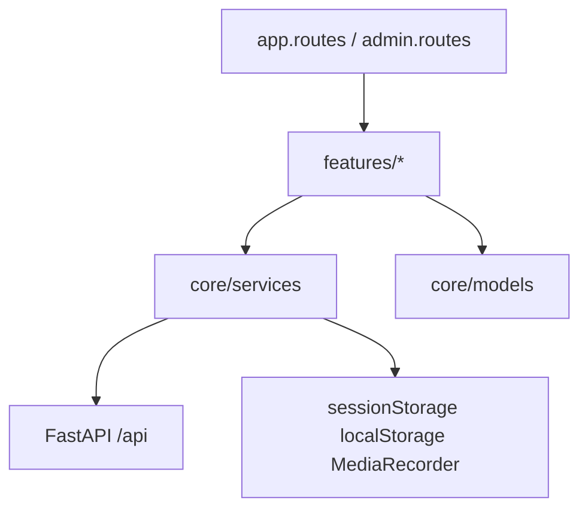

# Kiến trúc frontend — MedAssist Web UI

Cập nhật theo code tại `src/webui/` (Angular).

## Mục tiêu và stack

- **Vai trò:** Trang landing với chatbot, form đăng ký lịch (pre-fill từ session), cổng admin (khoa, bác sĩ, lịch theo bác sĩ).
- **Stack:** Angular 21, standalone components, Angular Material + CDK, RxJS, `@ngx-translate/core` (i18n), `fetch` cho SSE chat (bên cạnh `HttpClient`).

## Phân lớp



- **`app.routes.ts`:** lazy routes gốc (`/`, `appointment/register`, `admin/**`).
- **`features/*`:** màn hình theo miền nghiệp vụ.
- **`core/services`:** gọi API, trạng thái chat (`ChatSessionStore`), session id, admin auth, speech.
- **`core/guards` / `core/interceptors`:** bảo vệ admin, gắn JWT cho đường dẫn admin.
- **`core/i18n`:** loader JSON, service, bản dịch tĩnh trong `assets/i18n/`.

## Route map

### Root ([`app.routes.ts`](../../src/webui/src/app/app.routes.ts))

| Route | Component / lazy | Chức năng |
| --- | --- | --- |
| `/` | `LandingPage` | Trang chính, widget chat |
| `/appointment/register` | `AppointmentRegisterComponent` | Form đặt lịch (`sessionId` / `session_id` query) |
| `/admin` | `adminRoutes` | Lazy children (đăng nhập + layout) |
| `**` | redirect `''` | Fallback |

### Admin ([`features/admin/admin.routes.ts`](../../src/webui/src/app/features/admin/admin.routes.ts))

| Route | Guard | Component |
| --- | --- | --- |
| `/admin/login` | `adminGuestGuard` | `AdminLoginComponent` |
| `/admin` | `adminAuthGuard` | `AdminLayoutComponent` (shell) |
| `/admin` → `''` | — | redirect `department` |
| `/admin/department` | — | `DepartmentListComponent` |
| `/admin/department/:departmentId` | — | `DepartmentDetailComponent` |
| `/admin/doctors` | — | `DoctorListComponent` |
| `/admin/department/:departmentId/doctor/:doctorId` | — | `DoctorDetailComponent` |

## Tích hợp backend

- **Chat SSE:** [`chat-session.store.ts`](../../src/webui/src/app/core/services/chat-session.store.ts) dùng `fetch` + đọc stream, parse `text/event-stream` (token, `appointment`, `thread_closed`, `done`, `error`, v.v.).
- **REST:** [`appointment-api.service.ts`](../../src/webui/src/app/core/services/appointment-api.service.ts), [`admin-api.service.ts`](../../src/webui/src/app/core/services/admin-api.service.ts) qua `HttpClient`.
- **Auth header:** [`admin-auth.interceptor.ts`](../../src/webui/src/app/core/interceptors/admin-auth.interceptor.ts) — gắn Bearer cho URL khớp `/api/admin/` hoặc `/api/doctor/` (số ít), **không** gắn nhầm `/api/doctors/` (catalog công khai).
- **Session:** [`session.service.ts`](../../src/webui/src/app/core/services/session.service.ts) — `session_id` trong `sessionStorage`; admin token trong `localStorage` ([`admin-auth.service.ts`](../../src/webui/src/app/core/services/admin-auth.service.ts)).
- **STT/TTS:** [`speech.service.ts`](../../src/webui/src/app/core/services/speech.service.ts) — ghi âm, upload STT, phát TTS.
- **API base:** [`environments/environment.ts`](../../src/webui/src/environments/environment.ts) (dev: thường trỏ thẳng `http://localhost:8000/api`), [`environment.prod.ts`](../../src/webui/src/environments/environment.prod.ts) (`/api` sau nginx).

## File map (`src/webui/`)

```text
src/webui/
├── .dockerignore
├── .gitignore
├── Dockerfile
├── README.md
├── angular.json
├── nginx-docker.conf       # Static + reverse proxy /api (Docker)
├── package.json
├── package-lock.json
├── proxy.conf.json         # Dev proxy /api → backend
├── tsconfig.json
├── tsconfig.app.json
├── scripts/
│   └── extract-i18n.mjs    # npm run i18n:extract
└── src/
    ├── index.html
    ├── main.ts
    ├── styles.scss
    ├── environments/
    │   ├── environment.ts
    │   └── environment.prod.ts
    ├── assets/
    │   ├── i18n/
    │   │   ├── en.json
    │   │   ├── ja.json
    │   │   └── vi.json
    │   └── fonts/
    │       ├── noto-sans/           # Self-hosted Noto Sans (latin, latin-ext, vietnamese weights)
    │       │   └── *.woff2
    │       └── noto-sans-jp/       # Noto Sans JP (Japanese weights)
    │           └── *.woff2
    └── app/
        ├── app.component.ts
        ├── app.config.ts           # Router, HttpClient + interceptor, ngx-translate
        ├── app.routes.ts
        ├── core/
        │   ├── components/navbar/
        │   │   ├── navbar.ts
        │   │   ├── navbar.html
        │   │   └── navbar.scss
        │   ├── guards/
        │   │   └── admin-auth.guard.ts
        │   ├── interceptors/
        │   │   └── admin-auth.interceptor.ts
        │   ├── i18n/
        │   │   ├── extract-markers.ts
        │   │   ├── i18n.service.ts
        │   │   ├── translate-http.loader.ts
        │   │   └── translations.ts
        │   ├── models/
        │   │   ├── admin.models.ts
        │   │   └── appointment.models.ts
        │   └── services/
        │       ├── admin-api.service.ts
        │       ├── admin-auth.service.ts
        │       ├── appointment-api.service.ts
        │       ├── chat-session.store.ts
        │       ├── session.service.ts
        │       └── speech.service.ts
        └── features/
            ├── landing-page/
            │   ├── landing-page.ts
            │   ├── landing-page.html
            │   └── landing-page.scss
            ├── chatbot-widget/
            │   ├── chatbot-widget.ts
            │   ├── chatbot-widget.html
            │   └── chatbot-widget.scss
            ├── chat/
            │   ├── message-input/
            │   │   ├── message-input.component.ts
            │   │   ├── message-input.component.html
            │   │   └── message-input.component.scss
            │   ├── message-list/
            │   │   ├── message-list.component.ts
            │   │   ├── message-list.component.html
            │   │   └── message-list.component.scss
            │   ├── models/
            │   │   └── message.model.ts   # Kiểu ChatMessage, card, stage, DetectedLanguage
            │   └── pipes/
            │       └── rich-text.pipe.ts
            ├── appointment-register/
            │   ├── appointment-register.component.ts
            │   ├── appointment-register.component.html
            │   └── appointment-register.component.scss
            └── admin/
                ├── admin.routes.ts
                ├── login/
                │   ├── admin-login.component.ts
                │   ├── admin-login.component.html
                │   └── admin-login.component.scss
                ├── layout/
                │   ├── admin-layout.component.ts
                │   ├── admin-layout.component.html
                │   └── admin-layout.component.scss
                ├── department-list/
                │   ├── department-list.component.ts
                │   ├── department-list.component.html
                │   └── department-list.component.scss
                ├── department-detail/
                │   ├── department-detail.component.ts
                │   ├── department-detail.component.html
                │   └── department-detail.component.scss
                ├── doctor-list/
                │   ├── doctor-list.component.ts
                │   ├── doctor-list.component.html
                │   └── doctor-list.component.scss
                └── doctor-detail/
                    ├── doctor-detail.component.ts
                    ├── doctor-detail.component.html
                    └── doctor-detail.component.scss
```

## Ghi chú tích hợp

- Chat dùng `fetch` thay vì chỉ `HttpClient` để đọc SSE từ `POST` một cách kiểm soát được.
- Form đặt lịch kỳ vọng draft từ luồng chat (`GET /api/sessions/.../patient-info`); có thể mở route để dev không qua chat nhưng luồng đầy đủ đi từ chat.
